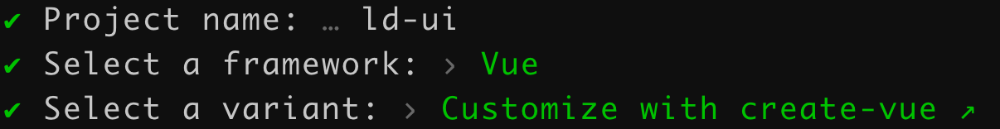

# 搭建开发环境

### 概览

1. 开发语言
   - HTML
   - SCSS
   - JavaScript
   - TypeScript
   - Vue 3
2. 构建工具
   - Vite
3. 包管理工具
   - pnpm
4. 规范化工具
   - ESLint：JavaScript 代码检查工具。
   - Prettier：代码格式化工具。
   - Stylelint：样式规范检查工具。
   - Husky：设置 Git hooks 验证 Git 提交的工具。
   - @commitlint/cli + @commitlint/config-conventional：Git 提交信息的规范工具。
5. 单元测试
   - Vitest
6. 文档
   - Vitepress
7. 代码部署
   - GitHub
8. 持续集成 CI
   - Github Action
9. package 发布
   - npm

### 过程

##### 一、初始化项目

使用 Vite 搭建开发环境，在终端中输入以下命令：

```bash
pnpm create vite
```

上述命令将会安装并执行 `create-vite` 包——作为 Vue 官方的项目脚手架工具，它会快速生成一个主流框架基础模板。在终端中会出现以下交互界面：



分别是：

1. 输入项目名称
2. 选择前端框架
3. 选择开发语言和可选功能配置

当模板生成好后，执行以下命令就可以在本地启动项目。

```bash
cd ld-ui
pnpm install
pnpm dev
```

##### 

